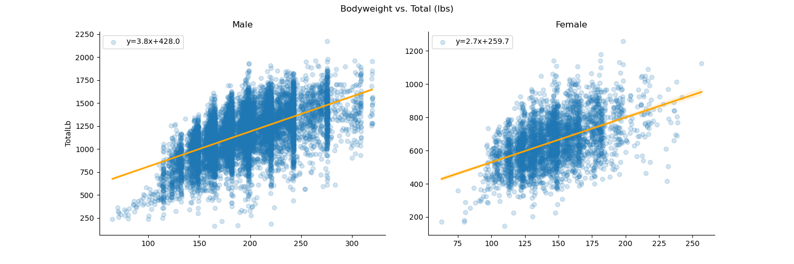

# New Jersey Powerlifting EDA: Project Overview

- Explored New Jersey competitive powerlifting data from 1985 to 2025.
- Downloaded dataset with over 3.4 million records from [openpowerlifting.org](https://www.openpowerlifting.org/).
- Cleaned the data, paying attention to duplication and reasonableness of values.
- Imputed for missing values and engineered a couple features to assist in the EDA.
- Outputted filtered and cleaned data subset as CSV file.
- Created meaningful visualizations to better understand characteristics and trends in the data.

## Tools Used

**Python**: 3.12.9  
**Packages**: pandas, numpy, matplotlib, seaborn, scipy

## Data Cleaning

The following changes were made to the original data, to best support the analysis I was trying to do:

- Filtered for only tested, full powerlifting meets in New Jersey
  - `Tested` == 'Yes', `MeetCountry` == 'USA', `MeetState` == 'NJ', `Event` == 'SBD', `Sanctioned` == 'Yes'
- Dropped many unneeded features, such as location columns, columns filtered for just one value, any lift features other than the lifter's best for each lift, etc.
- Filtered out any records where the lifter was disqualified or failed to register a successful attempt for any of the three lifts
- Removed duplicate records (primarily caused by lifters entering multiple divisions within the same meet, necessitating duplicated results with different `Division` values)
- Created a `MeetYear` feature, from the `Date` column
- Created a corresponding column in lbs for all columns in kgs.

## EDA

A few of the visual highlights:

**Competitive powerlifting totals have stayed relatively consistent throughout the years.**

**While the lifts are all strongly correlated with each other, there is a lot of variation in a lifter's relative strength (especially for women).**

**Every pound of bodyweight is expected to add 1.1 times more powerlifting strength for men than for women.**

**The relationship between age and powerlifting totals follows a downward parabola, with performance peaking in early adulthood before gradually declining with age.**

